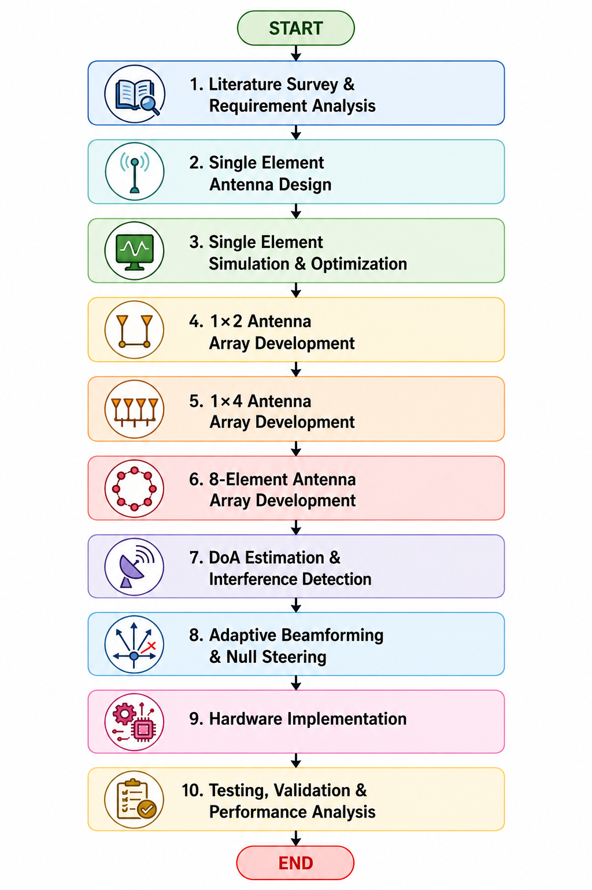
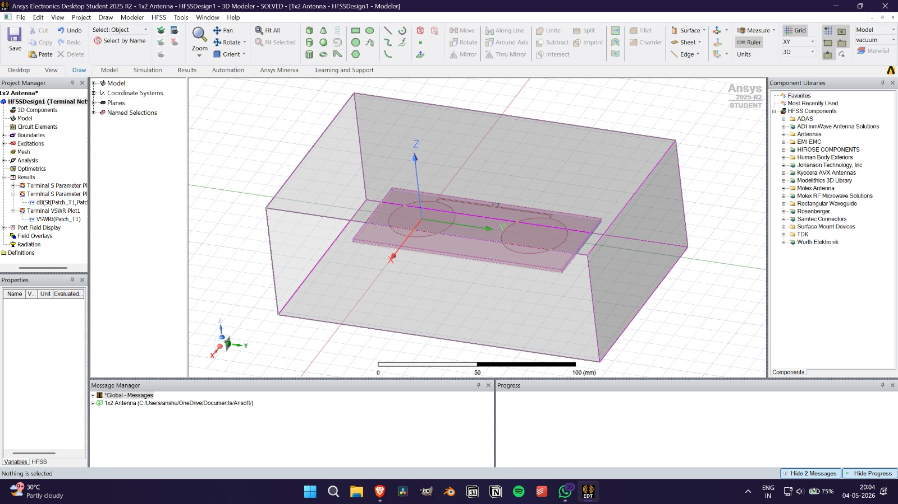
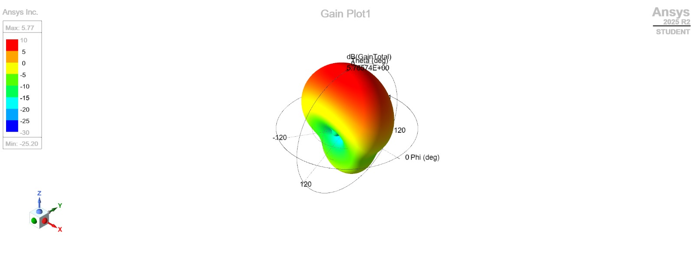
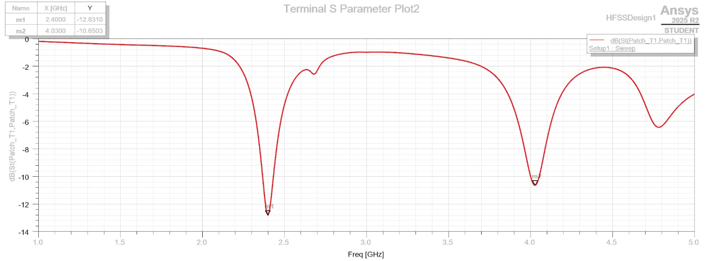
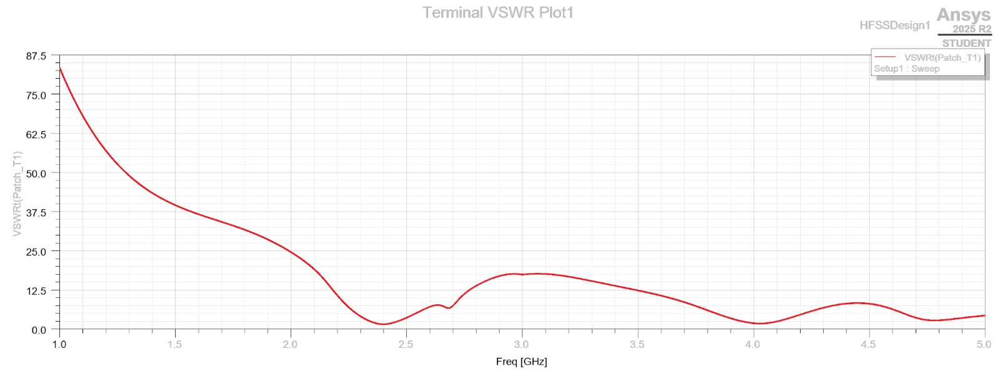

# 8-element-quad-band-anti-jamming-antenna
NavIC-based 8-element quad-band anti-jamming antenna system designed and simulated using HFSS.

## Project Overview

This project focuses on the design and development of an 8-element quad-band anti-jamming antenna system for NavIC-based navigation applications. The objective is to improve signal reliability, suppress interference, and enhance navigation performance in challenging RF environments.

The project combines antenna array design, RF front-end architecture, adaptive beamforming, null steering, and Direction of Arrival (DoA) estimation techniques.

## Objectives

* Design an 8-element quad-band antenna array
* Improve communication reliability in interference-prone environments
* Implement anti-jamming techniques using adaptive processing
* Analyze gain, return loss, VSWR, and radiation characteristics

## Project Workflow

## Current Status

Ongoing Major Project (Semester VII)

Completed:
- Literature Survey
- 1×1 Antenna Design
- 1×2 Antenna Array Development
- Gain Analysis
- Return Loss Analysis

In Progress:
- 1×4 Antenna Array Development
- 8-Element Array Design

Upcoming:
- DoA Estimation
- Adaptive Beamforming
- Hardware Implementation

## Antenna Design

### 1×2 Antenna Array

## Simulation Results

### Gain Analysis

### Return Loss Analysis

## Project Report

Full project documentation available in:
docs/major-project-report.pdf

## Tools & Technologies

* ANSYS HFSS
* MATLAB
* Python
* NavIC
* RF Communication Systems

## Key Concepts

* Antenna Arrays
* Adaptive Beamforming
* Null Steering
* Direction of Arrival (DoA) Estimation
* Spatial Filtering
* Anti-Jamming Systems

## Applications

* NavIC Navigation Systems
* UAV Navigation
* Defence Communication Systems
* Aviation Navigation
* Maritime Navigation

## Future Scope

* Complete 8-element array implementation
* Real-time beamforming
* FPGA/SDR integration
* Hardware fabrication and testing

## Author

Ansh Taralekar

Electronics & Telecommunication Engineering  
K. J. Somaiya Institute of Technology
